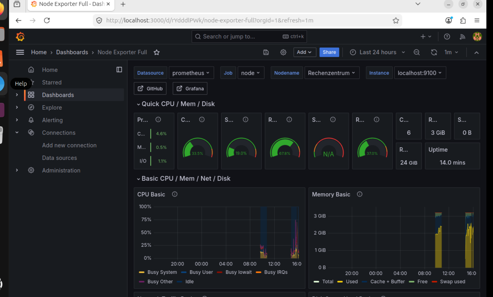

# Rechenzentrum Portfolio 🖥️

## About
Self-hosted Linux infrastructure project built as preparation 
for Google Data Center operations role in Dietzenbach, Germany.

Aufgebaut von Tracy — Vorbereitung für Google Dietzenbach.

## Monitoring Dashboard

## Projekte
- ✅ Nginx Webserver — eigene Seite gehostet
- ✅ Prometheus + Grafana — Live Monitoring Dashboard
- ✅ Automatisches Backup Script mit Cron Job

## Skills
- Linux Administration
- Server Monitoring
- Bash Scripting
- SSH & SCP
- Git & GitHub
